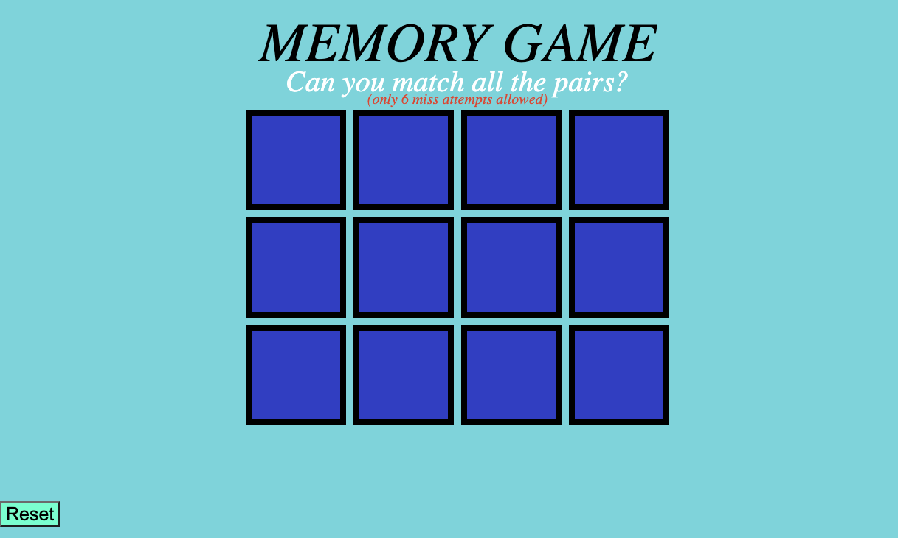
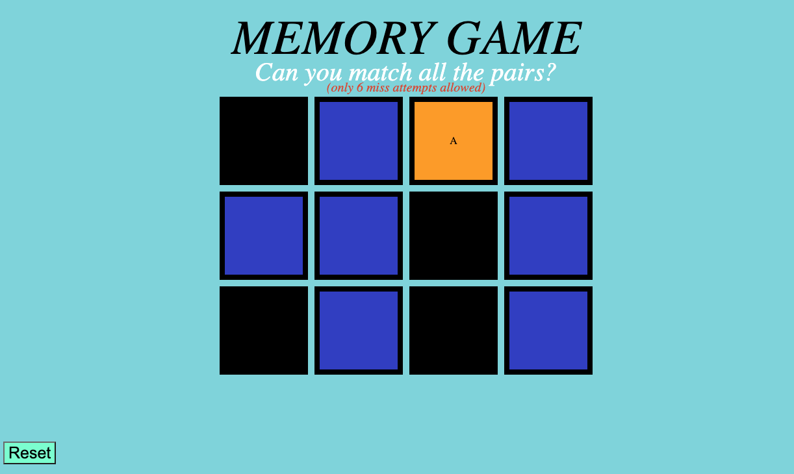
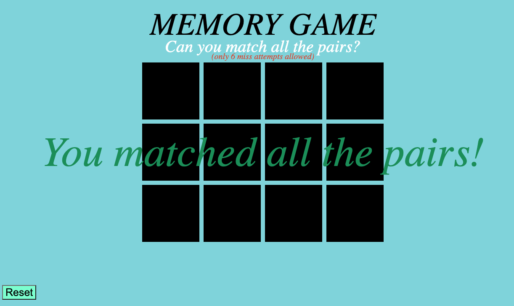
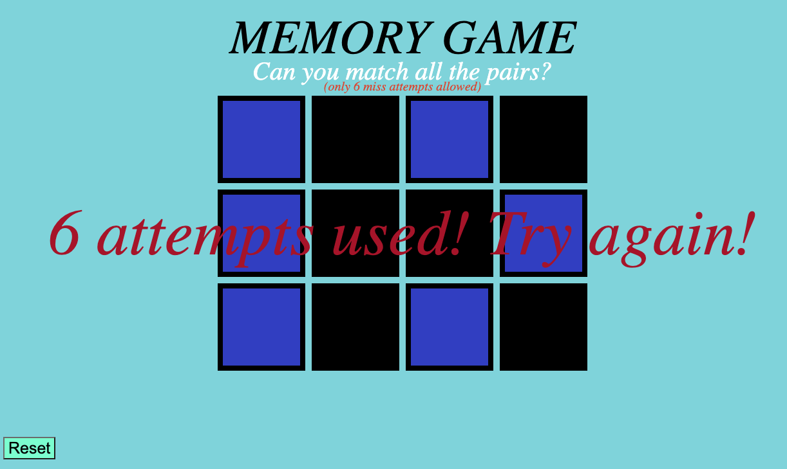

# Memory-Concentration-Game/Project 1

## [Link to Game](https://cesarjg12.github.io/MemoryGameProject1/)

---

## How to Play
1. Click the link above. This will direct you to the game in your browser.
2. Make sure to read the rules, you have 6 attempts before a lost game.
3. Click the cards and start matching the correct letters on the cards to their pair.
4. When you hover over a card it will turn yellow, and orange after you click it (Be sure to move your mouse from hovering it to see the orange color.)
5. After you clicked one card it will remain orange until you click another card.
6. If the second card you click matches the first card it will automatically turn black.
7. Keep on clicking the cards until you matched the whole board for a successful win.
8. If you happen to lose or wish to try again simply click the refresh page on your browser and try again!
9. Be sure to have fun and enjoy yourself!

---
## How the start of the game looks
 
---

---
## Game in Progress

---
---
## WIN/LOST GAME

---

---
---
## Code Preview

```js
function gameEnds() {
  console.log('Hello')
  if (matchedCards.length === cardChooser.length) {
    const messageWin = document.querySelector('h2');
    messageWin.innerHTML = 'You matched all the pairs!';
  }
```

```js
  function lostGame() {
  if (attempts >= 6) {
    // if (flippedCards.length === 2) {
    flippedCards.forEach(clickedCard => {
      clickedCard.classList.remove('flipped')
    });
    resetCards();
    const messageLost = document.querySelector('h3')
    messageLost.innerHTML = '6 attempts used! Try again!';
  }
}
```

---
## Tech Used
* HTML
* CSS
* Javascript
---

## Future Steps
* Fix the reset button
* Add pictures
* Make sounds for the flip(s)
* Create a timer
* Creat a Highscore board and increase number of cards
